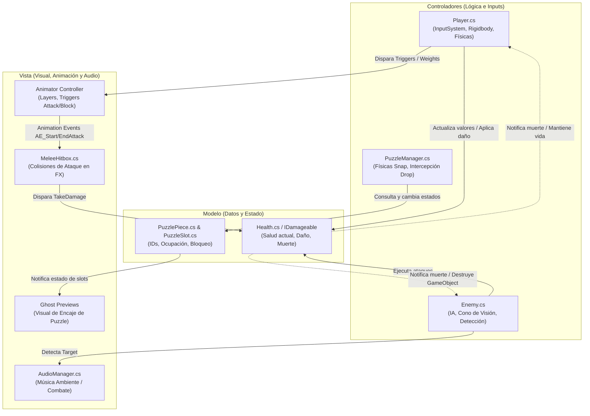

```mermaid
graph TD
    subgraph CONTROLLER ["Controladores (Lógica e Inputs)"]
        C_Player["Player.cs<br/>(InputSystem, Rigidbody, Físicas)"]
        C_Enemy["Enemy.cs<br/>(IA, Cono de Visión, Detección)"]
        C_PuzzleMgr["PuzzleManager.cs<br/>(Físicas Snap, Intercepción Drop)"]
    end

    subgraph MODEL ["Modelo (Datos y Estado)"]
        M_Health["Health.cs / IDamageable<br/>(Salud actual, Daño, Muerte)"]
        M_PuzzleState["PuzzlePiece.cs & PuzzleSlot.cs<br/>(IDs, Ocupación, Bloqueo)"]
    end

    subgraph VIEW ["Vista (Visual, Animación y Audio)"]
        V_Animator["Animator Controller<br/>(Layers, Triggers Attack/Block)"]
        V_Hitbox["MeleeHitbox.cs<br/>(Colisiones de Ataque en FX)"]
        V_Audio["AudioManager.cs<br/>(Música Ambiente / Combate)"]
        V_Ghosts["Ghost Previews<br/>(Visual de Encaje de Puzzle)"]
    end

    %% Flujos de interacción del Player
    C_Player -->|Actualiza valores / Aplica daño| M_Health
    C_Player -->|Dispara Triggers / Weights| V_Animator
    V_Animator -->|Animation Events AE_Start/EndAttack| V_Hitbox
    V_Hitbox -->|Dispara TakeDamage| M_Health

    %% Flujos del Enemigo
    C_Enemy -->|Detecta Target| V_Audio
    C_Enemy -->|Ejecuta ataques| M_Health

    %% Flujos del Puzzle
    C_PuzzleMgr -->|Consulta y cambia estados| M_PuzzleState
    M_PuzzleState -->|Notifica estado de slots| V_Ghosts

    %% Retroalimentación del Modelo a la Vista/Controlador
    M_Health -.->|Notifica muerte / Mantiene vida| C_Player
    M_Health -.->|Notifica muerte / Destruye GameObject| C_Enemy
```