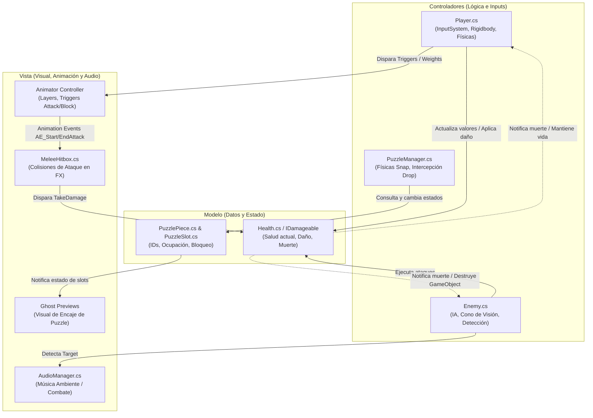

# Arquitectura del Juego - Diagrama de Clases

```mermaid
classDiagram
    class MonoBehaviour {
        <<UnityEngine>>
    }

    class IDamageable {
        <<Interface>>
        +TakeDamage(int damageAmount)*
    }

    class Player {
        -float _walkSpeed
        -float _runSpeed
        -float _attackSpeedFactor
        -float _blockSpeedFactor
        -bool _isAttacking
        -bool _blockHeld
        -Rigidbody rb
        -Animator _animator
        -PlayerLookAt _lookAt
        -PlayerInput _playerInput
        -MeleeHitbox playerSwordHitbox
        +bool RotateToMovement
        +bool IsBusy
        +bool IsAttacking
        +bool IsBlocking
        +AE_StartAttack()
        +AE_EndAttack()
        +OnMove(InputValue value)
        +TriggerAttack()
        -OnAttackPerformed(CallbackContext context)
        -OnBlockStarted(CallbackContext context)
        -OnBlockCanceled(CallbackContext context)
        -IsInAttackingState() bool
    }

    class Enemy {
        +int rutina
        +float cronometro
        +int speed
        +int speedDetected
        +GameObject target
        +float viewRadius
        +float viewAngle
        +bool attack
        -Rigidbody rb
        +Comportamiento()
        +CanSeePlayer() bool
        +Final_Ani()
    }

    class Health {
        -int maxHealth
        -int currentHealth
        +int CurrentHealth
        +TakeDamage(int damageAmount)
        -Die()
    }

    class MeleeHitbox {
        +int damage
        -LayerMask targetLayer
        -List~Collider~ alreadyHit
        -Collider hitboxCollider
        +EnableHitbox()
        +DisableHitbox()
        -OnTriggerEnter(Collider other)
    }

    class PuzzleManager {
        -PuzzleSlot[] _slots
        -HandGrabManager _grabManager
        -GameObject _rewardPrefab
        -Transform _rewardSpawnPoint
        -float _snapDuration
        -HashSet~PuzzlePiece~ _snapping
        +bool IsComplete
        +Completed event
        +SetGhostPreviewsEnabled(bool show)
        -HandlePickedUp(Rigidbody body)
        -HandleDropInterceptor(Rigidbody body) bool
        -FindNearestFreeSlot(PuzzlePiece piece, Vector3 position) PuzzleSlot
        -SnapRoutine(PuzzlePiece piece, PuzzleSlot slot) IEnumerator
        -CheckCompletion()
        -SpawnReward()
    }

    class PuzzleSlot {
        -string _acceptedPieceId
        -float _snapRadius
        -GameObject _ghostPreview
        +string AcceptedPieceId
        +PuzzlePiece Occupant
        +bool GhostsEnabled
        +float SnapRadius
        +bool IsOccupied
        +bool IsCorrect
        +CanAccept(PuzzlePiece piece) bool
        +Fill(PuzzlePiece piece)
        +Clear(PuzzlePiece piece)
        +SetGhost(GameObject ghost)
        +UpdateGhost()
    }

    class PuzzlePiece {
        -string _pieceId
        -Rigidbody _rb
        +string PieceId
        +bool IsLocked
        +bool IsSnapping
        +PuzzleSlot CurrentSlot
        +Rigidbody Body
        +Lock()
    }

    class AudioManager {
        +static AudioManager Instance
        -AudioSource ambientSource
        -AudioSource combatSource
        -AudioSource sfxSource
        -float fadeDuration
        -bool inCombat
        +SetCombatState(bool enableCombat)
        +playClip(AudioClip clip)
        -CrossfadeMusic(float targetAmbient, float targetCombat) IEnumerator
    }

    %% Herencia de MonoBehavior
    MonoBehaviour <|-- Player
    MonoBehaviour <|-- Enemy
    MonoBehaviour <|-- Health
    MonoBehaviour <|-- MeleeHitbox
    MonoBehaviour <|-- PuzzleManager
    MonoBehaviour <|-- PuzzleSlot
    MonoBehaviour <|-- PuzzlePiece
    MonoBehaviour <|-- AudioManager

    %% Implementación de interfaces
    IDamageable <|.. Health

    %% Relaciones del código
    Player --> MeleeHitbox : Activa/Desactiva via Animation Events (AE)
    MeleeHitbox ..> IDamageable : Aplica daño a objetivos colisionados
    Enemy --> AudioManager : Cambia estado a combate (SetCombatState)
    Enemy --> GameObject : Target (Player)
    PuzzleManager --> HandGrabManager : Intercepta eventos de Agarre/Soltar
    PuzzleManager "1" o-- "*" PuzzleSlot : Gestiona lista de slots
    PuzzleManager "1" o-- "*" PuzzlePiece : Gestiona piezas en animación/snap
    PuzzleSlot "1" <--> "0..1" PuzzlePiece : Ocupación bidireccional (Occupant / CurrentSlot)
```

```mermaid
graph TD
    subgraph CONTROLLER ["Controladores (Lógica e Inputs)"]
        C_Player["Player.cs<br/>(InputSystem, Rigidbody, Físicas)"]
        C_Enemy["Enemy.cs<br/>(IA, Cono de Visión, Detección)"]
        C_PuzzleMgr["PuzzleManager.cs<br/>(Físicas Snap, Intercepción Drop)"]
    end

    subgraph MODEL ["Modelo (Datos y Estado)"]
        M_Health["Health.cs / IDamageable<br/>(Salud actual, Daño, Muerte)"]
        M_PuzzleState["PuzzlePiece.cs & PuzzleSlot.cs<br/>(IDs, Ocupación, Bloqueo)"]
    end

    subgraph VIEW ["Vista (Visual, Animación y Audio)"]
        V_Animator["Animator Controller<br/>(Layers, Triggers Attack/Block)"]
        V_Hitbox["MeleeHitbox.cs<br/>(Colisiones de Ataque en FX)"]
        V_Audio["AudioManager.cs<br/>(Música Ambiente / Combate)"]
        V_Ghosts["Ghost Previews<br/>(Visual de Encaje de Puzzle)"]
    end

    %% Flujos de interacción del Player
    C_Player -->|Actualiza valores / Aplica daño| M_Health
    C_Player -->|Dispara Triggers / Weights| V_Animator
    V_Animator -->|Animation Events AE_Start/EndAttack| V_Hitbox
    V_Hitbox -->|Dispara TakeDamage| M_Health

    %% Flujos del Enemigo
    C_Enemy -->|Detecta Target| V_Audio
    C_Enemy -->|Ejecuta ataques| M_Health

    %% Flujos del Puzzle
    C_PuzzleMgr -->|Consulta y cambia estados| M_PuzzleState
    M_PuzzleState -->|Notifica estado de slots| V_Ghosts

    %% Retroalimentación del Modelo a la Vista/Controlador
    M_Health -.->|Notifica muerte / Mantiene vida| C_Player
    M_Health -.->|Notifica muerte / Destruye GameObject| C_Enemy
```
