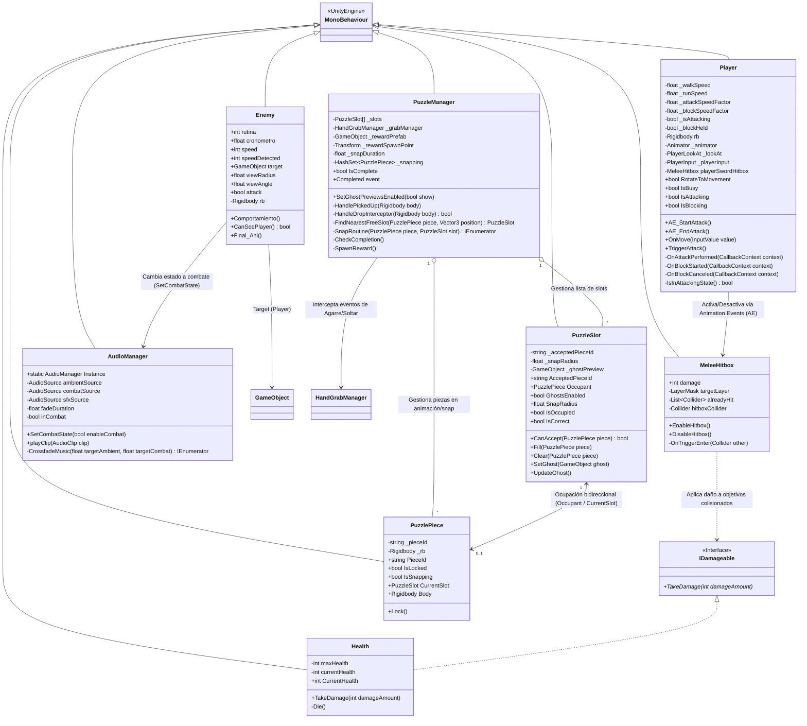
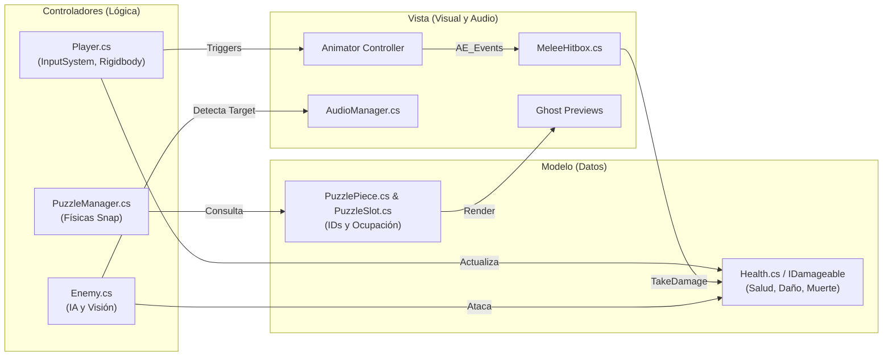
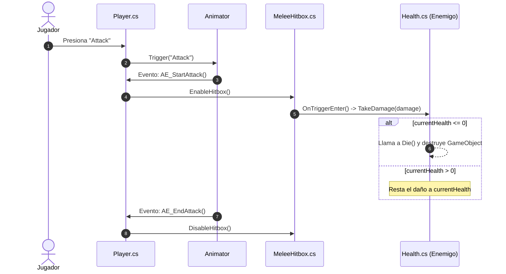
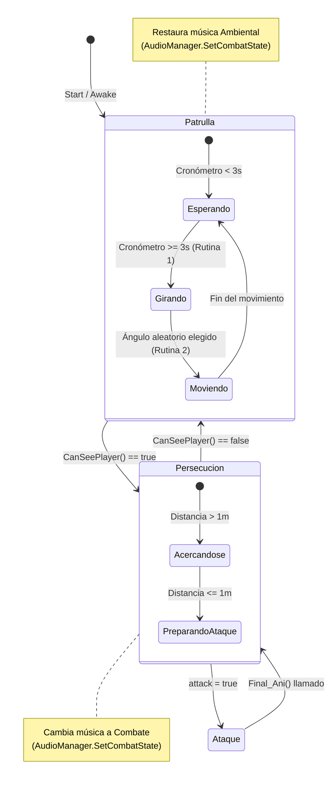

# Documentación de Arquitectura y Diseño - Proyecto Bolívar

## 1. Diagrama de Clases (UML)

---

## 2. Arquitectura MVC (Modelo - Controlador - Vista)

---

## 3. Diagrama de Secuencia: Sistema de Combate

---

## 4. Máquina de Estados Finitos (FSM): IA del Enemigo

